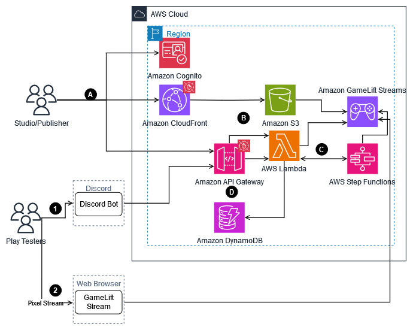
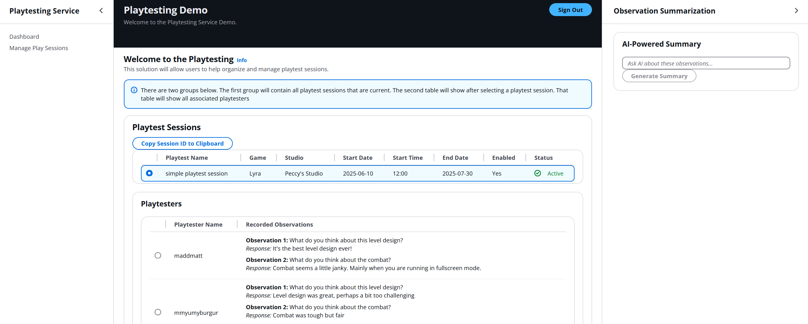
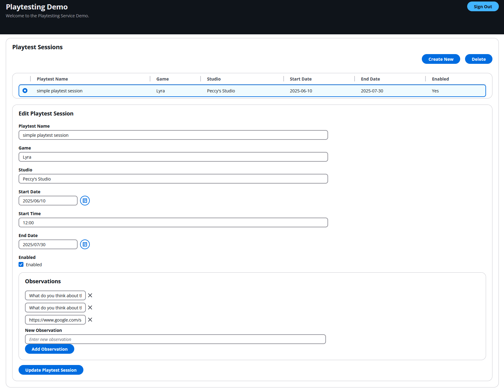
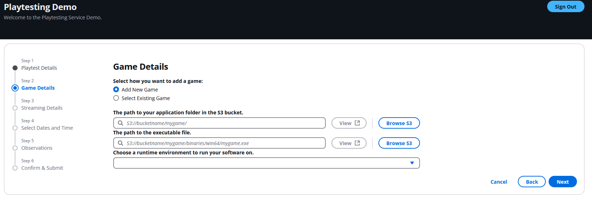
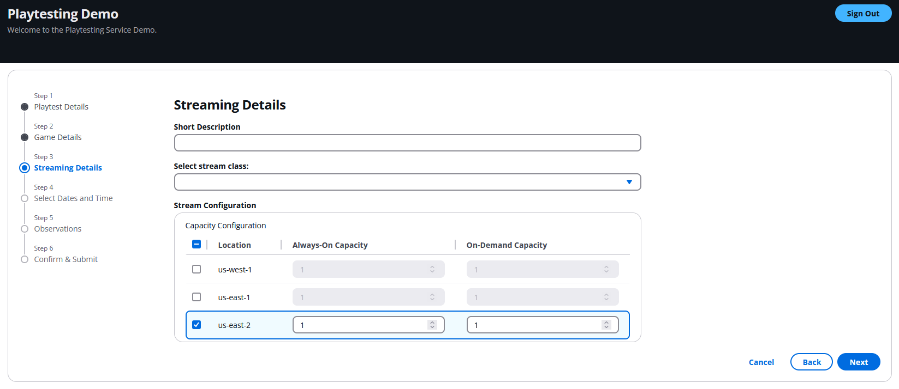

# Guidance for Scalable Game Playtesting and QA on AWS

### Required

1. [Overview](#overview)
    - [Cost](#cost)
2. [Prerequisites](#prerequisites)
    - [Operating System](#operating-system)
3. [Deployment Steps](#deployment-steps)
4. [Deployment Validation](#deployment-validation)
5. [Running the Guidance](#running-the-guidance)
6. [Next Steps](#next-steps)
7. [Cleanup](#cleanup)


## Overview

This guidance helps customers by providing a starter kit for their playtesting needs.  Today customers face many challenges with playtesting, one of those challenges is having an easy way to have playtester signup to playtest.  Another challenge is coordinating client side builds across many unique PC setups across the world.  Futhermore, the concern around sharing pre-launch gaming builds can become quite a scary experience for new startups as they have to find ways to best secure their IP.  With this guidance customers can leverage a full solution made up of three parts:  1. React front end that enables customers to serve their playerbase with a streamed playtesting experience as well as a full administrative portal for studios and publishers.  2. Full backend infrastructure enabling the front end via API's and secured with WAF as well as Cognito for authorization.  3.  A starter Discord bot setup that allows playtesters to never leave Discord to "Opt-In" and register for playtest sessions.




### Cost

_You are responsible for the cost of the AWS services used while running this Guidance. As of July 2025, the cost for running this Guidance with the default settings in the US East (N. Virginia and Ohio for GameLift Streams) is approximately $11,954 per month for servicing ( 100 players playing 8 hrs per day for a week straight)._

_We recommend creating a [Budget](https://docs.aws.amazon.com/cost-management/latest/userguide/budgets-managing-costs.html) through [AWS Cost Explorer](https://aws.amazon.com/aws-cost-management/aws-cost-explorer/) to help manage costs. Prices are subject to change. For full details, refer to the pricing webpage for each AWS service used in this Guidance._

The following table provides a sample cost breakdown for deploying this Guidance with the default parameters in the US East (N. Virginia) and US West (Ohio) Region for one month.

| AWS service  | Dimensions | Cost [USD] per month|
| ----------- | ------------ | ------------ |
| Amazon API Gateway | 1,000,000 REST API calls per month  | $ 3.50 |
| Amazon Cognito | 2 active users per month with advanced security feature | $ 0.10 |
| Amazon CloudFront | Data transfer out to internet (.264 GB per month), Number of requests (HTTPS) (100000 per month) | $ 0.10 |
| Amazon Simple Storage Service (S3) | S3 Standard storage (.00264 GB per month) | $ 0.00 |
| AWS Lambda | Number of requests (1000000 per month) | $ 0.00 |
| Amazon DynamoDB | Table class (Standard), Average item size (all attributes) (1000 Byte), Data storage size (0.5 GB) | $ 1.63 |
| AWS Step Functions | Workflow requests (100 per month), State transitions per workflow (11) | $ 0.00 |
| AWS Web Application Firewall (WAF) | Number of Web Access Control Lists (Web ACLs) utilized (2 per month), Number of Rules added per Web ACL (5 per month) | $ 20.60 |
| Amazon GameLift Streams | 100 players streaming 8 hrs per day x 7 days using windows Gen5 stream class at $2.13 per hr | $ 11,928.00 |

## Prerequisites

### Operating System

These deployment instructions should work well on both Windows and Mac based OS.  Below are some installs that need to happen before deploying.

- Install [node](https://nodejs.org/en/download/) (v22 or above).  (Optionally: install node and npm with the [Node Version Manager](https://github.com/nvm-sh/nvm).
- Install [npm](https://docs.npmjs.com/downloading-and-installing-node-js-and-npm)
- Use [aws-cdk](https://docs.aws.amazon.com/cdk/v2/guide/cli.html).  You can use aws configure via aws-cli or other mechanism to authenticate your terminal in order to use CDK
- Make sure you have installed [AWS CLI](https://docs.aws.amazon.com/cli/v1/userguide/cli-chap-install.html)
- Make sure you have your [AWS Profile setup](https://docs.aws.amazon.com/cli/v1/userguide/cli-chap-configure.html) to point to the correct account as well as us-east-2 for the region
- [CDK Bootstrap if you have not previously deployed infrastructure using cdk into your AWS account](https://docs.aws.amazon.com/cdk/v2/guide/bootstrapping.html)


### Supported Regions

While the backendstack can technically be deployed to any region we try to keep it in a region supported by GameLift Streams.  Below are the currently supported regions of GameLift Streams

-US East (N. Virginia), US East (Ohio), US West (Oregon), Asia Pacific (Tokyo), Europe (Frankfurt), and Europe (Ireland)


## Deployment Steps

1. Clone the repo using command ```git clone https://github.com/aws-solutions-library-samples/guidance-for-scalable-game-playtesting-and-qa-on-aws.git```
2. cd to the repo folder ```cd <repo-name>/source```
3. Install dependencies in all subprojects and lambdas ```npm run install-all```
4. Run ```npm run deploy-all --user=ADMIN_USERNAME --password=ADMIN_PASSWORD --email=USER@example.com --PTuser=PLAYTESTER_USERNAME --PTpassword=PLAYTESTER_PASSWORD --PTemail=PLAYTESTER@example.com``` to deploy the entire solution.  With the exception of the Discord Bot.
5. Use the URL in the output options when deployment is complete to access the admin portal. You will also need this URL for the discord bot along with ApiKey that you'll need to get from API Gateway. Install time should take 15-20 minutes.

### Deploying Discord Bot

1. Open CloudFormation console (make sure you are viewing the region with your ApiStack which should be us-east-2 by default) and click on the Outputs Tab of the PlaytestingApiStack
2. Copy the Endpoint URL as you'll need this for the Discord Bot.
3. Open API Gateway console.  On the left hand side, click on API Keys.
4. Copy the playtesting-api-key ```API Key``` (there should be a copy to clipboard icon by the masked values).  You will need this for the Discord Bot.
5. Open up the admin portion of the playtesting solution and login using the admin user.
6. On the dashboard select the playtest session you wish to setup for registering with the Discord bot and click on the ```Copy Session ID to Clipboard``` button.  This is the final piece needed to configure your discord bot.
7. Refere [here](https://github.com/aws-solutions-library-samples/guidance-for-scalable-game-playtesting-and-qa-on-aws/blob/main/source/bot/README.md) to guide you through editing your Discord bot with these 3 values as well as deploying your Discord bot.


## Deployment Validation

* Open CloudFormation console and verify the status of the template with the named PlaytestingFrontendStack in us-east-1 (N. Virgina) and PlaytestingApiStack in us-east-2 (Ohio).
* Open CloudFormation console (make sure you are viewing the region with your frontend Stack wich should be us-east-1 by default) and click on the Outputs Tab of the PlaytestingFrontendStack
* Navigate to the CloudFrontDomain URL listed.  Use your admin credentials that you chose when installing the solution to login.  If successful you should see the home page.


## Running the Guidance

In this guidance we will walk through the basic functions of the admin page as well as the playtesting page that playtesters will see.  NOTE: we won't be setting up a playtest session with this guidance as this solution guidance doesn't ship with a testable game. 

### Login admin and playtesters

Currently, the solution guidance is shipped with Cognito and two accounts will be created.  Both of which was created upon installation.  The admin user should be used for administration purposes and the playtester account is given out to playtesters.  If playtesters try to access the admin portion of the react app, they will not be allowed due to cognito groups.  Playtesters will be given the playtester credentials upon registrations and will be prompted to login when they access the unique URL that is generated by the Discord bot.  Admin can browse to the cloudfront generated URL that can be found within the output section of the PlaytestingFrontendStack.  From there admin will be prompted to login.  Token Validity for both Admin and Playtester logins is good for 1 hour by default installation.

### Admin Functions

- Home page - Show playtest sessions that have been created.  You can select a playtest session and see (if any) all playtesters that have submitted any observation feedback to the session.  Furthermore, on the right handside of the screen you can expand the window to generate a summarization of feedback received.  Below are some common questions you may consider asking.  Left hand saide of the page you will see your collapsable menu (should be expanded by default).  Currently, there are two options (Dashboard and Manage Play Sessions)

  - "What is the overall opinion of this playtest session based upon playtesters' feedback?"

  - "What areas should we focus our next development cycle based upon playtesters' feedback?"



- Manage Play Sessions - This view allows users to perform CRUD operations on playtest sessions.  If there are no sessions to edit you can click on the "Create New" button to start a creation wizard process.  If there are play sessions to pick from you can select one and immediately edit options become available.  When creating new play sessions make note that behind the scenes AWS is spinning up a new stream group in your account and this proccess can take a few minutes.



Note:  When creating a new playtest session Step 2 gives you an option for "Add New Game" or "Select Existing Game"  If you haven't previously added an "application" to GameLift Streams nor previously "Add New Game" when creating an earlier playtest session; you will need to select "Add New Game."  We require that your game binaries are located in an S3 bucket before hand.  Tip:  May consider having your CI/CD process deposit game builds into this S3 location to make this process easier.



Note:  By default on Step 3 the stream configuration has us-east-2 (which is Ohio) with an always-on capacity and on-demand capacity of 1.  Each location allows you to allocate capacity in.  The capacity would be available playtesters streaming your game.  For example, if you have a playtest session for next weekend and are expecting 100 players you might want to set an "On-Demand" capacity to 100 and "Always-On' at 0.  Or mix and match with 50/50.




## Next Steps

Currently this guidance demonstrates setting up a single playtest session with a single Bot. For multiple playtest sessions that you may want running at the same time, try deploying multiple versions of the Discord Bot with different Session ID's.  Furthermore, while we walk through a simple playtest session setup using a single region; you may want to consider leveraging multiple regions when setting up a playtesting session. 


## Cleanup

- First, let's make sure that we empty the S3 buckets that host the frontend application.
- Navigate to S3 and empty out the two buckets created.  They should start with ```playtestingfrontendstack-xxxxxxxx```
- Open CloudFormation console (make sure you are viewing the region with your ApiStack which should be us-east-2 by default) and select the PlaytestingApiStack and delete the stack.
- Open CloudFormation console (make sure you are viewing the region with your FrontendStack which should be us-east-1 by default) and select the PlaytestingFrontendStack and delete the stack.
