# Guidance for Scalable Game Playtesting and QA on AWS

1. [Overview](#overview)
    - [Cost](#cost)
2. [Prerequisites](#prerequisites)
    - [Operating System](#operating-system)
    - [Supported Regions](#supported-regions)
3. [Deployment Steps](#deployment-steps)
    - [Deploying Discord Bot](#deploying-discord-bot)
4. [Enabling Sentiment Analysis](#enabling-sentiment-analysis)
5. [Deployment Validation](#deployment-validation)
6. [Running the Guidance](#running-the-guidance)
    - [Admin](#admin)
        - [Logging In](#logging-in)
        - [Home Page and Dashboard](#home-page-and-dashboard)
        - [Managing your playtests](#managing-your-playtests)
        - [Sentiment Analysis and Summarizations](#sentiment-analysis-and-summarizations)
    - [Playtesters](#playtesters)
        - [Playtester Logging In](#playtester-logging-in)
        - [Playtesting](#playtesting)
    - [Running the Bot](#running-the-bot)
7. [Next Steps](#next-steps)
8. [Cleanup](#cleanup)


## Overview

This guidance helps customers by providing a starter kit for their playtesting needs. Today, customers face many challenges with playtesting. One of those challenges is not having an easy way for playtesters to signup for playtesting. Another challenge is coordinating client-side builds across many unique PC setups around the world. Furthermore, the concern around sharing pre-launch gaming builds can become quite a scary experience for new startups, as they have to find ways to best secure their IP. With this guidance, customers can leverage a full solution made up of three parts: 1. React front end that enables customers to serve their player base with a streamed playtesting experience as well as a full administrative portal for studios and publishers; 2. Full backend infrastructure enabling the frontend via APIs, secured with [AWS WAF](https://aws.amazon.com/waf/) as well as [Amazon Cognito](https://aws.amazon.com/cognito/) for authorization; 3. A starter Discord bot setup that allows playtesters to never leave Discord to "Opt-In" and register for playtest sessions.

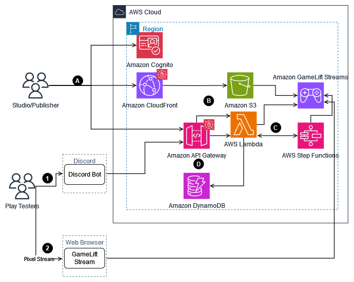


### Definitions

- Playtester: A user who will be playtesting a game session via web frontend.  This user will be given an URL that will launch them into a web frontend in which they start the game session and play the game.  During playtesting, users are expected to record their observations via the test panel provided.
- Playtest Session:  A game session that is created by a studio to be active during a given time frame.  These sessions can be partial game builds or full game builds that studios upload during the playtest session creation process.  a playtest session can have multiple playtesters that will connect to the game session all using Amazon GameLift Streams.
- Observation: Created during the playtest session process.  Observations are questions posed by a studio/publisher that require playtester's to respond to during a playtest session.  For example, a studio may create a playtest session with these observations.  *What do you think about the combat style?* or *How does the layout feel with this current level design?*  Playtesters respond to each question during a playtesting session.


### Cost

_You are responsible for the cost of the AWS services used while running this Guidance. As of July 2025, the cost for running this Guidance with the default settings in the US East (N. Virginia and Ohio for GameLift Streams) is approximately $11,964 per month for servicing (100 players playing 8 hours per day for a week straight)._

_We recommend creating an [AWS Budget](https://docs.aws.amazon.com/cost-management/latest/userguide/budgets-managing-costs.html) through [AWS Cost Explorer](https://aws.amazon.com/aws-cost-management/aws-cost-explorer/) to help manage costs. Prices are subject to change. For full details, refer to the pricing webpage for each AWS service used in this Guidance._

The following table provides a sample cost breakdown for deploying this Guidance with the default parameters in the US East (N. Virginia and Ohio) Regions for one month.

| AWS service  | Dimensions | Cost [USD] per month|
| ----------- | ------------ | ------------ |
| Amazon API Gateway | 1,000,000 REST API calls per month  | $ 3.50 |
| Amazon Cognito | 2 active users per month with advanced security feature | $ 0.10 |
| Amazon CloudFront | Data transfer out to internet (.264 GB per month), Number of requests (HTTPS) (100000 per month) | $ 0.10 |
| Amazon Simple Storage Service (S3) | S3 Standard storage (.00264 GB per month) | $ 0.00 |
| AWS Lambda | Number of requests (1000000 per month) | $ 0.00 |
| Amazon DynamoDB | Table class (Standard), Average item size (all attributes) (1000 Byte), Data storage size (0.5 GB) | $ 1.63 |
| AWS Step Functions | Workflow requests (100 per month), State transitions per workflow (11) | $ 0.00 |
| AWS Web Application Firewall (WAF) | Number of Web Access Control Lists (Web ACLs) utilized (2 per month), Number of Rules added per Web ACL (5 per month) | $ 20.60 |
| Amazon Bedrock | Claude 3 Haiku, 1 avg request per minute for 8 hours per day.  100 average input tokens with 500 average output tokens | $ 9.36 |
| Amazon GameLift Streams | 100 players streaming 8 hours per day, for 7 days, using Windows Gen5 stream class at $2.13 per hour | $ 11,928.00 |

## Prerequisites

### Operating System

These deployment instructions work on both Windows and Mac-based operating systems. Below are the required installations before deploying:

- Install [Node.js](https://nodejs.org/en/download/) (v22 or above).  (Optional: install Node.js and npm with the [Node Version Manager](https://github.com/nvm-sh/nvm).
- Install [npm](https://docs.npmjs.com/downloading-and-installing-node-js-and-npm)
- Use the [AWS Cloud Development Kit](https://docs.aws.amazon.com/cdk/v2/guide/cli.html) (AWS CDK).  You can use aws configure via AWS CLI or other mechanisms to authenticate your terminal to use CDK
- Make sure you have installed [AWS Command Line Interface](https://docs.aws.amazon.com/cli/v1/userguide/cli-chap-install.html) (AWS CLI)
- Make sure you have your [AWS Profile](https://docs.aws.amazon.com/cli/v1/userguide/cli-chap-configure.html) set up to point to the correct account and the us-east-2 region


### Supported Regions

While the backend stack can technically be deployed to any region, it should be deployed in a region supported by GameLift Streams. Below are the currently supported regions for GameLift Streams:

- US East (N. Virginia)
- US East (Ohio)
- US West (Oregon)
- Asia Pacific (Tokyo)
- Europe (Frankfurt)
- Europe (Ireland)


## Deployment Steps

1. Clone the repo using command:

 ```git clone https://github.com/aws-solutions-library-samples/guidance-for-scalable-game-playtesting-and-qa-on-aws.git```

2. Change directory to the repo folder:

 ```cd <repo-name>/source```

3. Install dependencies in all subprojects and Lambda functions:

 ```npm run install-all```

4. (skip if already have bootstrapped account).  Perform [CDK Bootstrap](https://docs.aws.amazon.com/cdk/v2/guide/bootstrapping.html) if you have not previously deployed infrastructure using AWS CDK in your AWS account
Supported Regions.  **NOTE: The default installation is within two regions (us-east-1 for the frontend and us-east-2 for the backend).  Be sure you have bootstrapped both regions**

5. Located the file *.env.example* within the source directory and remove the *.example* extensions.  Open that .env file and replace each value then save your changes (see images below): This is used to create your initial admin cognito account for using the admin portal.  You will be prompted to change your password and verify your email address after login.

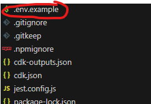
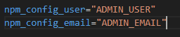

6. Run the following command to deploy the entire solution (except the Discord Bot):

 ```npm run deploy-all``` 

7. When deployment is complete, to access the admin portal use the URL in the PlaytestingFrontendStack Outputs tab within CloudFormation on the AWS Console.  Optionally, you should see the URL located in the terminal window after deployment (should see *Outputs: PlaytestingFrontendStack.CloudFrontDomain = <YOUR_CLOUDFRONT_URL>*). Install time should take 15-20 minutes.

8. After installation is complete, you should see a *.user-credentials* within the source directory.  Within it is the admin temporary credentials.  Please delete this file for security purposes after using.

### Deploying Discord Bot

Refer [here](https://github.com/aws-solutions-library-samples/guidance-for-scalable-game-playtesting-and-qa-on-aws/blob/main/source/bot/README.md) to guide you through editing your Discord bot with these values, as well as deploying your Discord bot.

## Enabling Sentiment Analysis

This is an optional step.  However, if you do not enable this section of the solution you will not be able to peform player response summarizations nor sentiment analysis.  You will be enabling a model within the AWS console underneath the bedrock service.

1. Navigate to your AWS Console

2. Search for Amazon Bedrock

3. On the left side of the screen underneath the Amazon Bedrock menu sections, scroll down to the section *Configure and learn* and select Model access. NOTE: make sure you are in the proper region where your API stack was installed (Ohio by default)

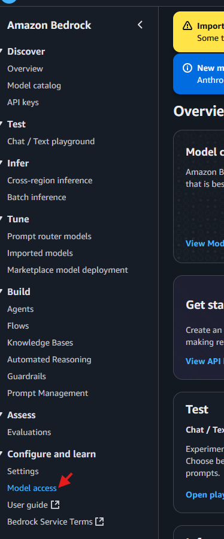

4. Locate the *Modify model access* button at the top of the page and click it.

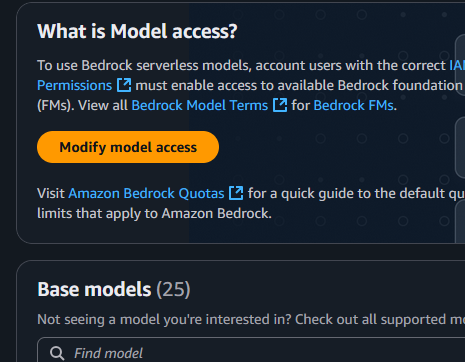

5. Now scroll down until you see the Anthropic section and select Claude 3 Haiku.  Then scroll down to the bottom of the page and click the next button.  Then on the next page click the submit button.  Now you are setup to use this feature.  Look in the *Running the Guidance* section for more details on how to use this feature.

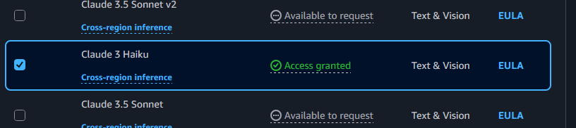

## Deployment Validation

* Open the CloudFormation console and verify the status of the templates PlaytestingFrontendStack in us-east-1 (N. Virgina) and PlaytestingApiStack in us-east-2 (Ohio).

* Open the CloudFormation console (make sure you are viewing the region with your frontend stack, which should be us-east-1 by default) and click on the Outputs Tab of the PlaytestingFrontendStack.

* Navigate to the CloudFrontDomain URL listed from step 7 above. Use your admin credentials that are within the *.user-credentials* file from step 8. If successful, you should see the home page.


## Running the Guidance

In this guidance, we will walk through the functions of the admin page as well as the playtesting page that playtesters will see. **NOTE: This solution does not ship with a testable game.**

### Admin

The Admin's portal is used to create and manage playtest sessions.  Furthermore, studios can get a sentiment/summerization of playtesters feedback per playtest session.  In the sections below we'll explore how to login, understanding the various pages, creating your first playtest session, further managing those playtest sessions, and interacting with the generative sentiment analysis of players feedback.

#### Logging In

After navigating to the newly created CloudFrontURL from installation process you will see a login box.  You'll need to navigate to your email account and look for your temporary password (check your junkmail if you don't receive an email after 5-10 minutes).  After logging in, you will be required to change your password.

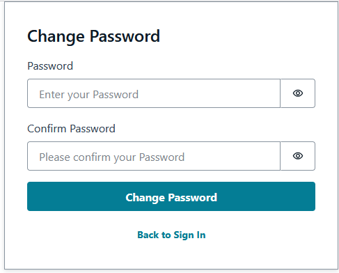

#### Home Page and Dashboard

After successfully logging in you will be routed to the home page/Dashboard.  On this screen you will see all created playtests sessions.  You will also be able to see any playtesters by selecting a playtest session.  On the left side of the screen you will see two links:  Dashboard and Manage playtest sessions.  On the right side of the screen you will see and "!" Icon that allows you to expand out the summarization/sentiment analysis ability for playtest sessions.  We will walk through all these functions further down.

#### Definitions

- Playtest Name: This is the name you give a playtest session
- Game: The name of the game (or build) that is being playtested
- Studio: The studio that created the game
- Start Date: The date that you wish the playtest session to be available.
- End Date:  The date tht you wish the playtest session to end (this is an inclusive date).
- Enabled: Is this playtest session currently enabled?
- Status: A playtest session could be in various status (Active, Error, Intializing)


Summarization/Sentiment Feature located by the signout button.  We will cover this feature further on down.  See image below

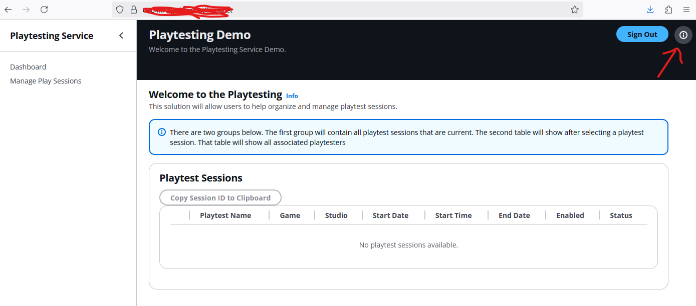

Let's go ahead and navigate to managing your playtests by clicking the Manage Play Sessions on the left side of the screen.  Now head into the *Managing your playtests* sections to setup your first playtest!

#### Managing your playtests

In this section we will walk you through setting up your first playtest session.  We will also point out the various features located in this area which are (Creating, Updating, and Deleting playtest sessions).  Let's start off with creating your first playtest session.  To do so, click the *Create New* button as you see below with the red arrow.

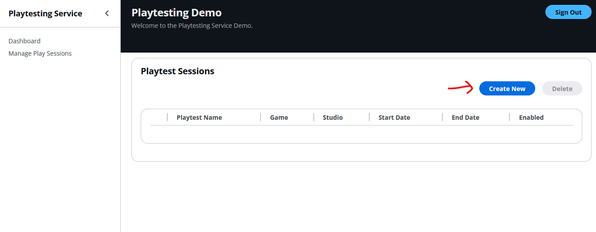

You should now see a wizard that will walk you through each of the 6 steps to submit your new playtest for creation.  On this first step, you will need to provide a few details.  Playtest Name (this is the name you give a playtest session), Game (The name of the game or build that is being playtested), and Studio (The studio that created the game).  Lastly, you should see an enabled checkbox that should be checked by default.  However, if you do not want this playtest session to be available for registration yet; feel free to disable it for now.  When all fields are filled out please click the Next button.

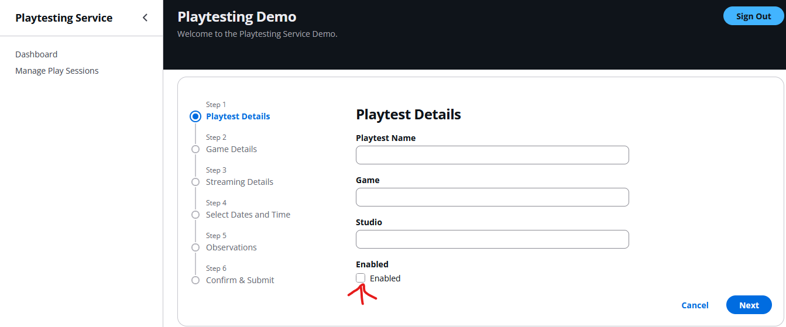

Game details section is where you specify the game that you wish to be playtested during this session.  This can be partial or full build, it doesn't matter as long as it's an executable.  You will see two radio buttons, the first *Add New Game* allows you to add your executable as a application (game) behind the scenes to GameLift streams.  When selecting *Add New Game* you will need to browse your S3 buckets and find:  

- the S3 Bucket path to the application/game folder (this should contain the executable as well as any other assets, libraries, etc).
- the S3 Bucket path to the executable itself (you should be selecting your .exe at this point).

Then you need to choose your runtime environment in order to run your game.  For example, if your game runs specifically on windows; then choose *Microsoft Windows Server 2022 Base*.  Now, if you already have previously added a new game either by creating a previous playtest session with a game added then; or if you had previously went to the AWS console within GameLift Streams and directly added it there.  Then you can choose the *Select Existing Game* option.  After either adding a new game or selecting a previously added on you may click the Next button to proceed.

**NOTES: As mention earlier, this process creates an application within GameLift Streams Console within your AWS account.  Also, If you plan to use a non windows based stream group be sure that you do not select a game that is windows base or you will have errors.**

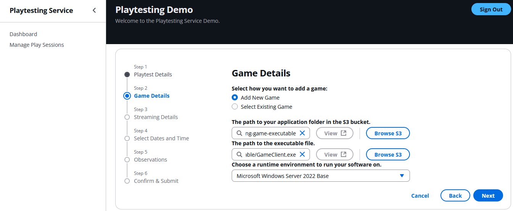  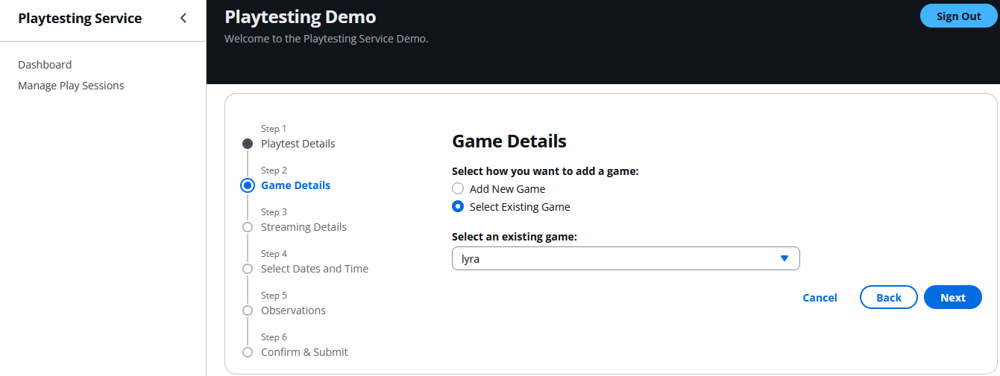

On step 3 you are setting up your streaming details.  This includes creating a short description for the streaming group you are creating.  For example, perhaps you are wanting to test how well your build works on a Gen4 GPU; so you would add those details to the description.  Then you would select the streaming class from the drop down menu.  Lastly, you select which regions you wish to deploy your playtest session to.  Within each region you will also define how much capacity you need (as well as type Always-on or On-Demand).  You must select at least one region.  When your selections have been made navigate to the next section

**NOTES:  Make sure you have the capacity available for the regions you are selecting or you will get an error creating the playtest session.  Check with your account team if you are unsure about region capacity for GameLift Stream groups**

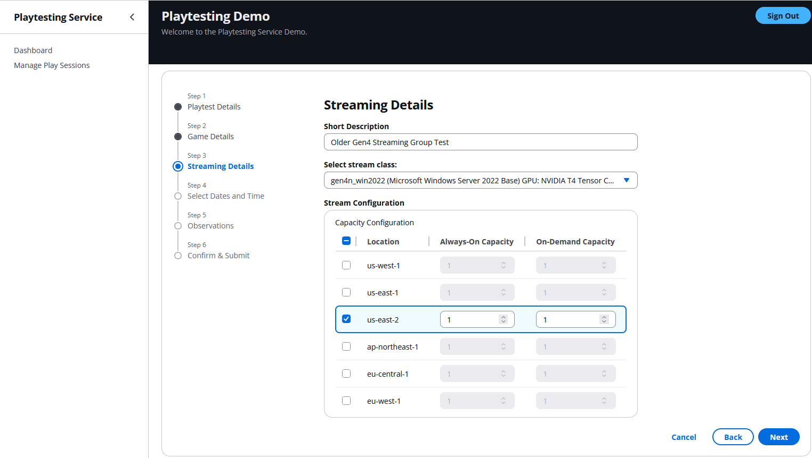

Step 4 we are selecting the start date, start time, and end date of the playtest session.  If playtesters try to playtest outside of this range they will not be able to.  After setting your playtest date range navigate to the next step.

**NOTE:  Currently if a playtester is playing a session while a session has expired or was marked disabled, the playtester will still be able to play.  Only when the playtester refreshes the screen will the changes be seen**

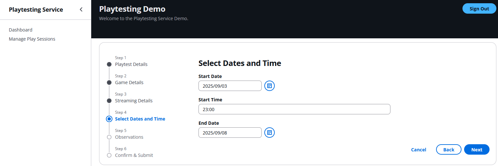

In step 5 we are creating questions for playtesters.  These are observations you would like playtesters to make when playing this session.  Currently, these are in free form text allow you to provide as much detail as possible to define what you would like your playtesters to examine during this session.  When you are satisfied with your questions for the playtest session navigate to the last step to submit and create.

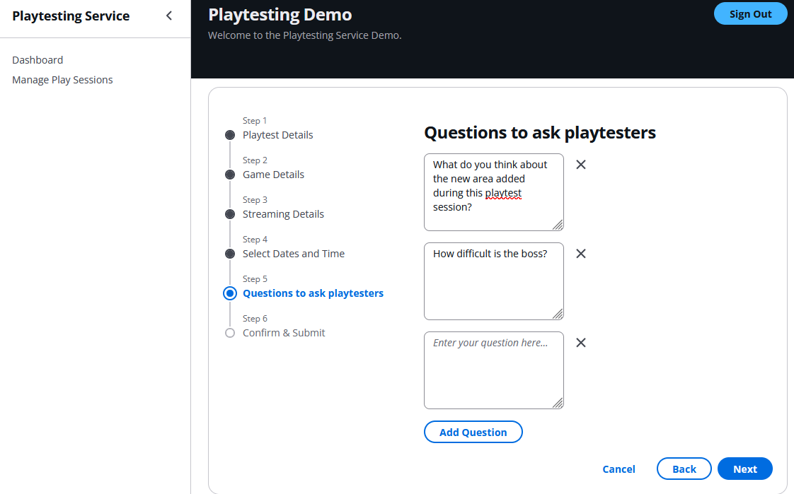

The final step of the process just reminds you to review your steps before creating the playtest session.  You can navigate to any step by clicking on the step you wish to navigate to on the left side of the wizard.  When you are ready click the *Create Playtest* button.  You should see a modal popup confirming the creation process and after confirming you will be brought back to the Dashboard screen in which your playtest solution will start the creation process.

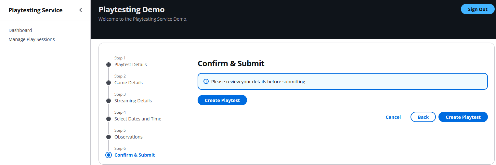

Back on the dashboard screen you should see a new playtest session on the dashboard with a status of *Initializing* Behind the scenes there is a Step Function process that is orchestrating the creation of a new GameLift Streams Application (or using an existing one) and GameLift Streams stream group.  This can take some time to finish initializing depending upon how many regions as well as capacity needed for each region

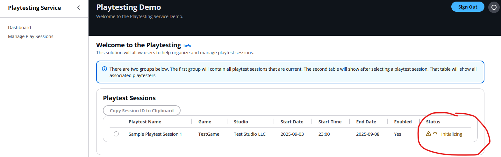

Below is a screenshot of the Step Function in action waiting to finish up.

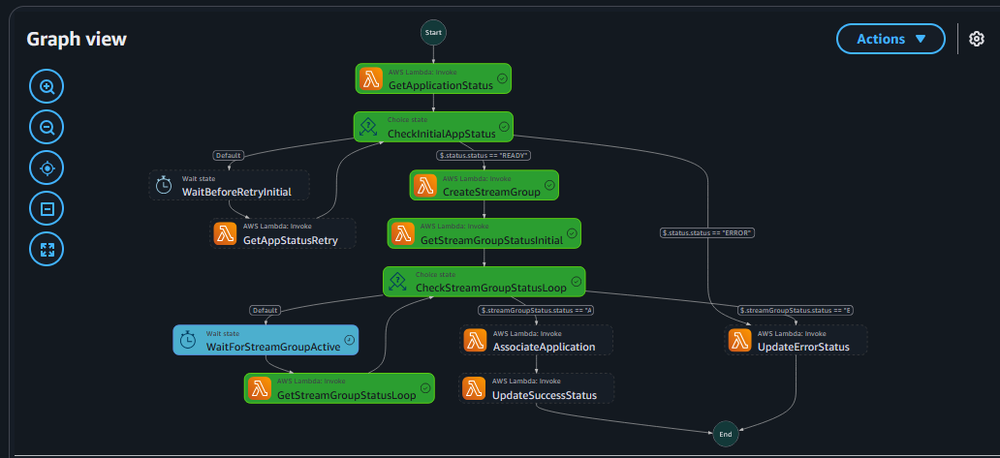

In some cases errors can happen.  For example, as noted above, if you try to set a capacity beyond what you have available within a particular region you will receive an error like below.

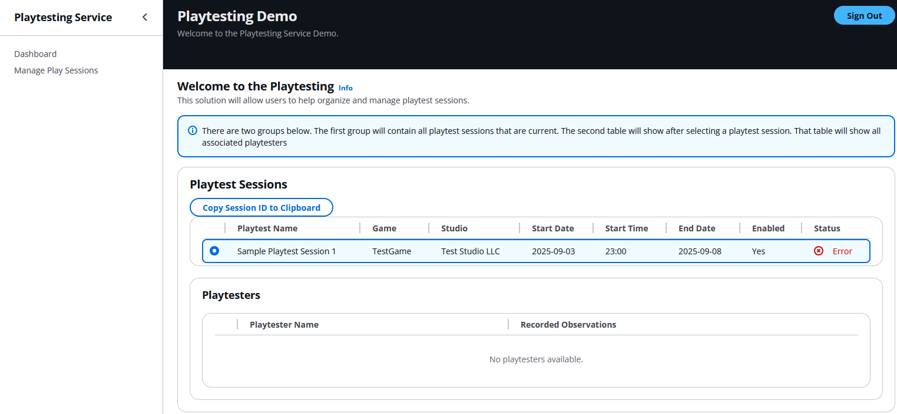

Best way to approach trouble shooting an error would be to work backwards from the step function and see which step the creation process failed at.  From there, you can investigate the API call that was made and ultimately review the CloudWatch logs of the associated Lambda function to see what caused the error.  In this particular case, I had exceed the capacity limit for a certain region I had selected after reviewing the CloudWatch logs.

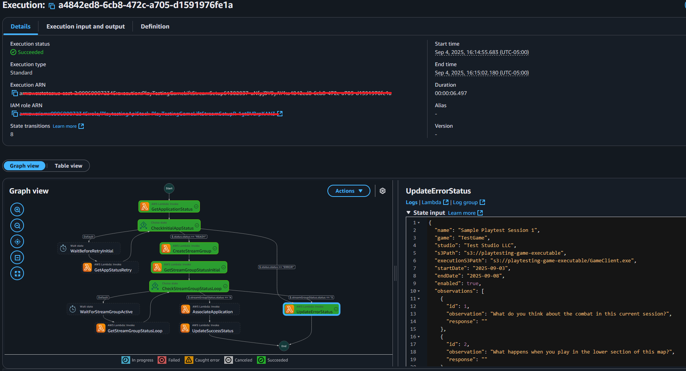

The best course of action if you get an error is to find out what caused the root error and then delete the playtest session and recreate again.  I'll show you later on how to delete a playtest session.  After creating a successful playtest session you should see an *Active* status indicating that your playtest session is ready to accept playtesters.

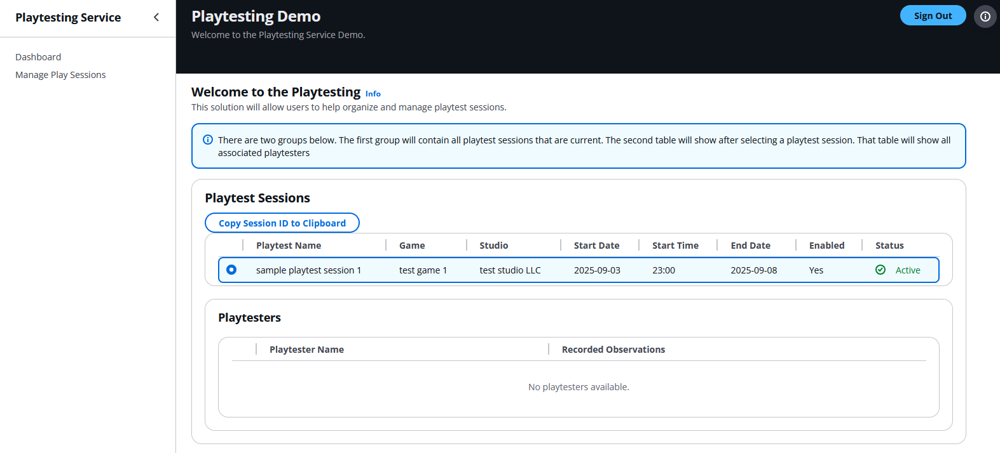

Now lets navigate back to managing your platest sessions and let's make some adjustments to the newly created playtest sessions.  This time when you head back to managing playtest sessions you will see a new record that shows up.  Please select that playtest session in order to make any updates.

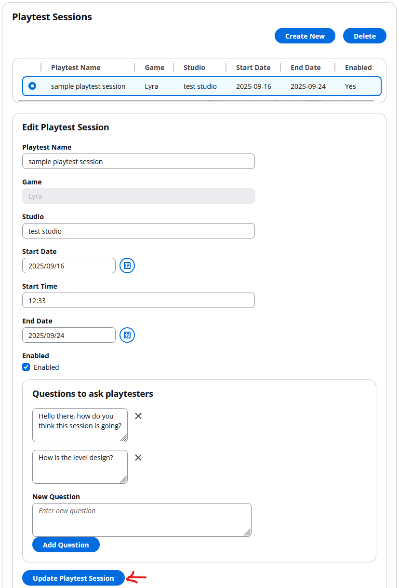

Note above all the fields that are editable.  Any changes made above will only take affect after clicking the *Update Playtest Session* button.  The screen will not refresh nor will you be navigated to a different page; but instead at the top you should see a green status message indicating that the update was made.  Make any updates you wish then navigate back to the Dashboard page to see them on the dashboard screen.

Let's say that this playtest is finished and you do not wish to keep it any longer.  Navigate back to manging your playtest sessions and select the playtest session you wish to delete.  After clicking delete you will be asked for confirmation before your deletion is made.

**NOTE: You don't have to delete playtest sessions, but if you do no playtester's response will be deleted they will still be present within the playtesters table within DynamoDB.  Currently, you will not be able to see nor use the summarize feature of playtester responses after deleting their corresponding playtest session**

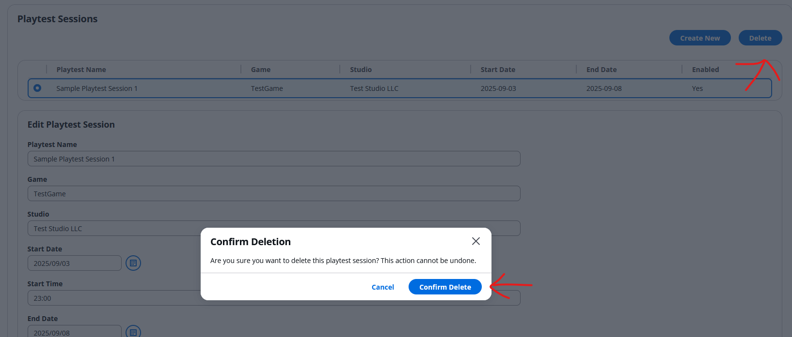

Now that we have explored how to manage our playtest sessions let's explore how we can see the playtesters and their responses.  We will also go through and summarize some of their responses using the GenAI feature of this solution.

### Sentiment Analysis and Summarizations

Navigate back to the dashboard page and select a playtest session.  Please select a playtest session that has playtesters that have recorded observations.  After selecting you should see the list of playtesters along with their recorded observations.

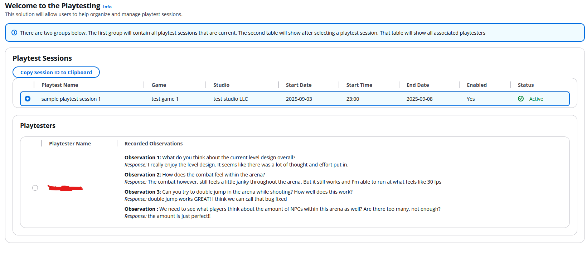

Now as long as a playtest session is selected and you have some recorded observations you can click the *I* icon on the top right of the screen to expand out the GenAI summarization feature.  From here you can ask the model questions about the playtest session such as "What do the players think about the current playtest session?"  or "What areas should we focus our next development efforts around based upon players responses?"

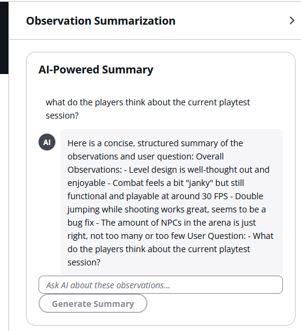

If you try to engage with the model without any data you will get a "Wild error" and we don't want that!

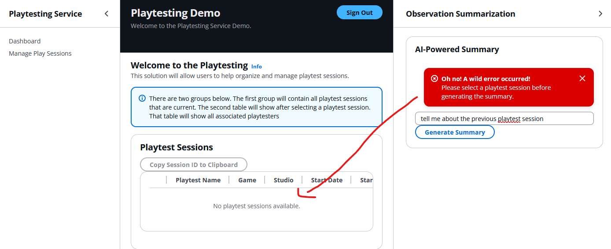

### Playtesters

The playtesters portal is used by playtesters to participate in a playtest session.  Playtesters will be able to select which region they wish to stream from (default is the lowest latency), start a stream for playtesting, and record observations.  Playtesters can return back to the same session (as long as it's still enabled and within date range) at anytime to further evaluate and record observations.

**NOTE: If a playtest session ony has a single region you will not be able to select other regions**

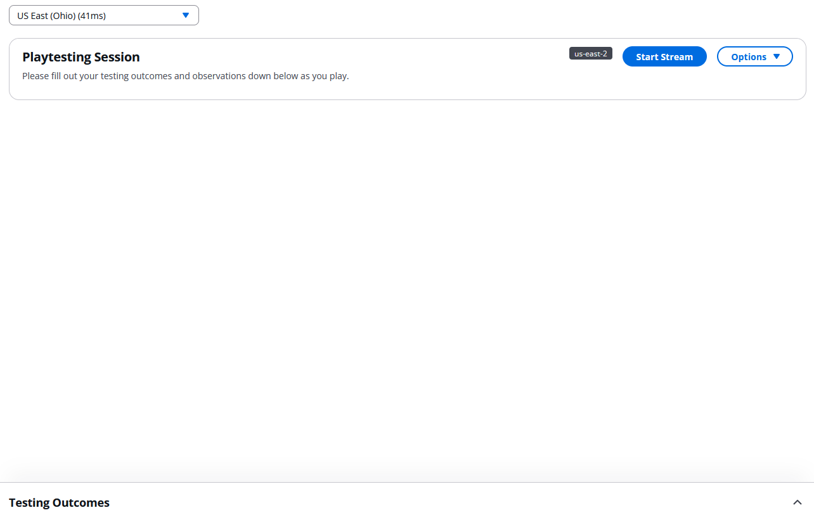

#### Playtester Logging In

After receving the URL from the Discord bot you will be prompted to enter your temporary password along with your username.  You'll need to navigate to your email account and look for your temporary password (check your junkmail if you don't receive an email after 5-10 minutes).  After logging in, you will be required to change your password.


#### Playtesting

When you have successfully logged in you will see the main playtesting page.  From here, choose which region you wish to start streaming from.  You can select a new region by locating the dropdown at the top left of the screen.  Notice that by default the lowest latency region has already been selected for you.

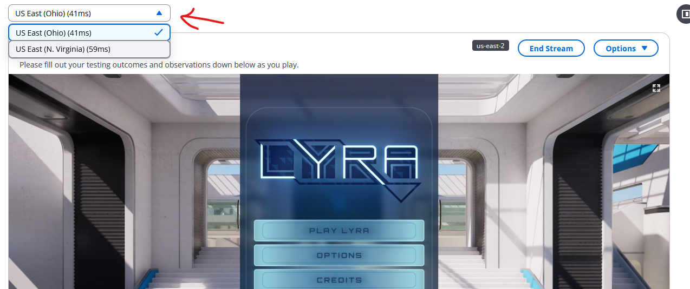

After you have selected your region let's go ahead and start the stream.  Locate the *Start Stream* button and click it.  It will turn grey as it awaits for your stream to be ready.  Some games (depending upon size) may take a few moments to intially start.

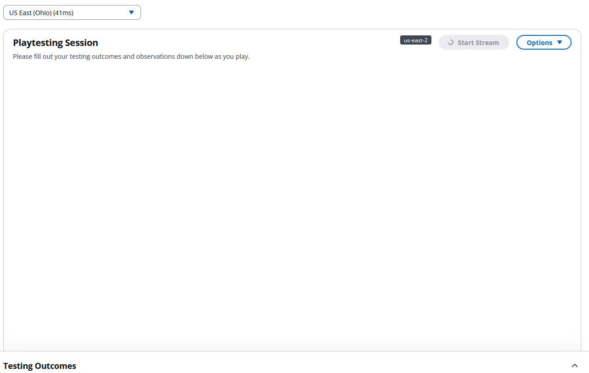

Then moments later you should see your game begin to stream like the image below

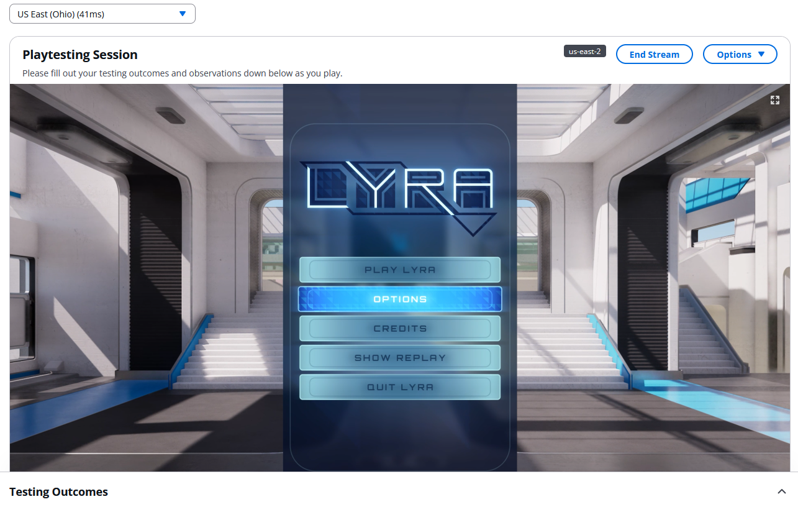

Now, lets look at the bottom of the page where the testing outcomes are located.  Look at the bottom right of the screen you should see an up arrow.  Click that to expand upwards the testing outcomes that the studio wishes for you to observe and record your observations.  Notice though, as you're streaming you will not be able to type in here until you've disabled the input.  Once you've disabled the input you can start recording your observations.  We have to disable the input otherwise the browser will still be trying to send keyboard commands to your game session.

**NOTE: However way you decided to record your observations don't forget to find the *Submit Observations* button located below all the testing outcomes.**

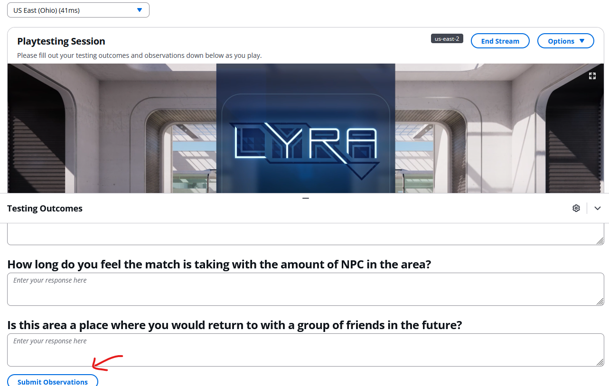

Use the options drop down to disable the input in order to edit the Testing outcome fields

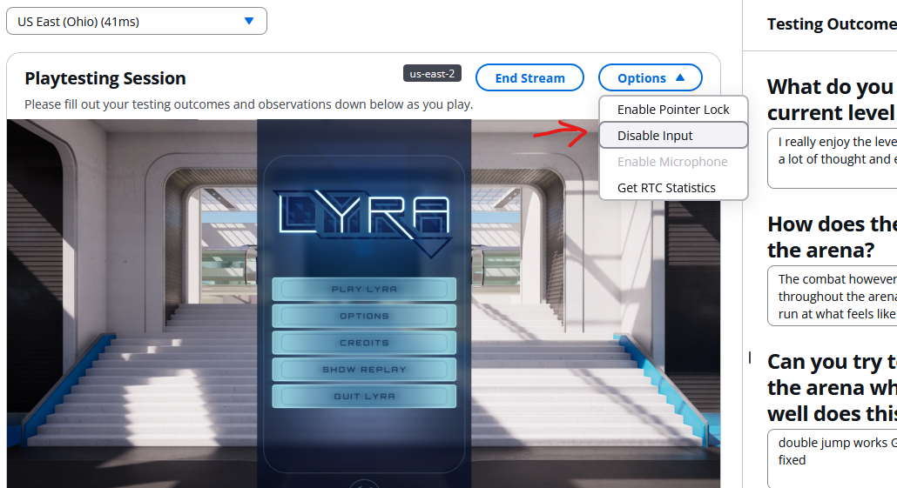

You may also notice the cog that is located now midway on the screen on the left-hand side from when the testing outcomes had expanded upwards.  If you click on this you will be given an option to move your testing outcomes to the left side of the screen instead of the bottom.  You can change this at anytime.

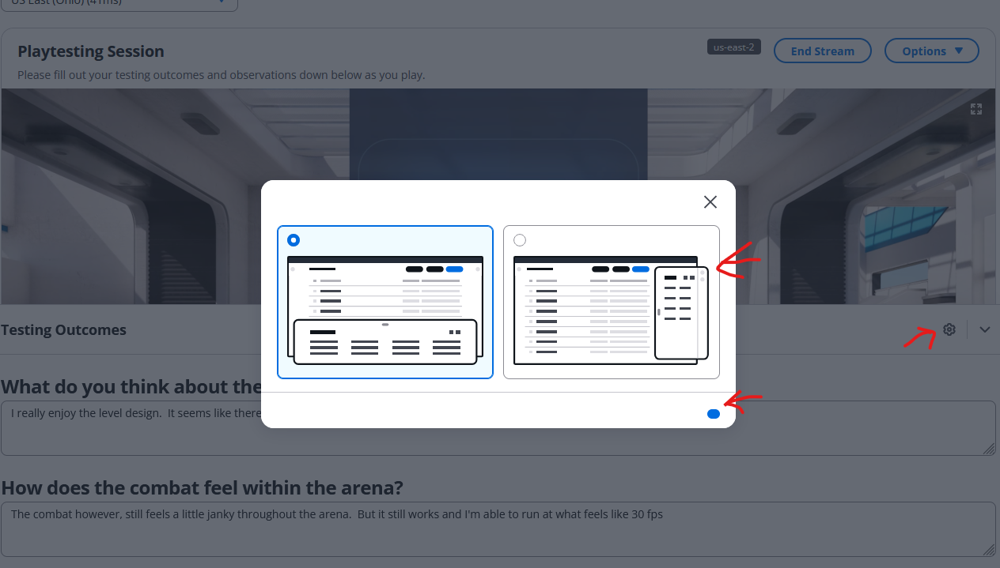

View of what the testing outcomes look like on the right side of the screen

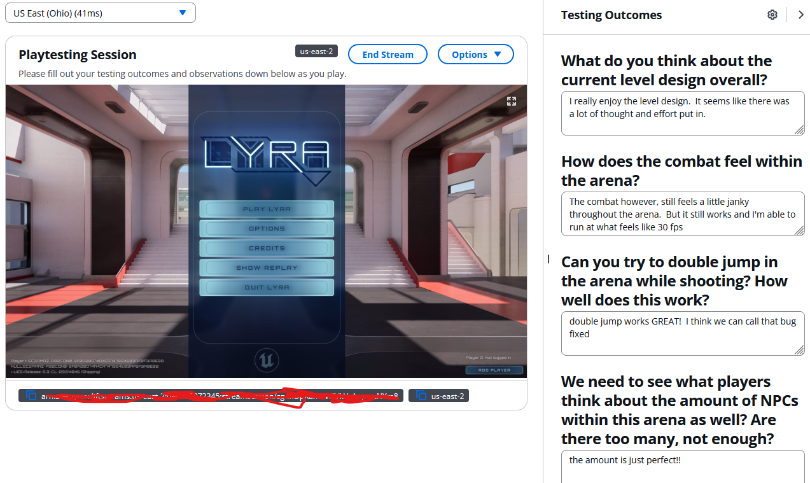

Now, you can choose to keep the default playtesting view of your stream.  Or, if you prefer to play fullscreen then locate the fullscreen icon in the upper right section of the stream screen.  Clicking that will put you into fullscreen mode.  While in fullscreen mode you may hit escape at anytime to return to the default view.

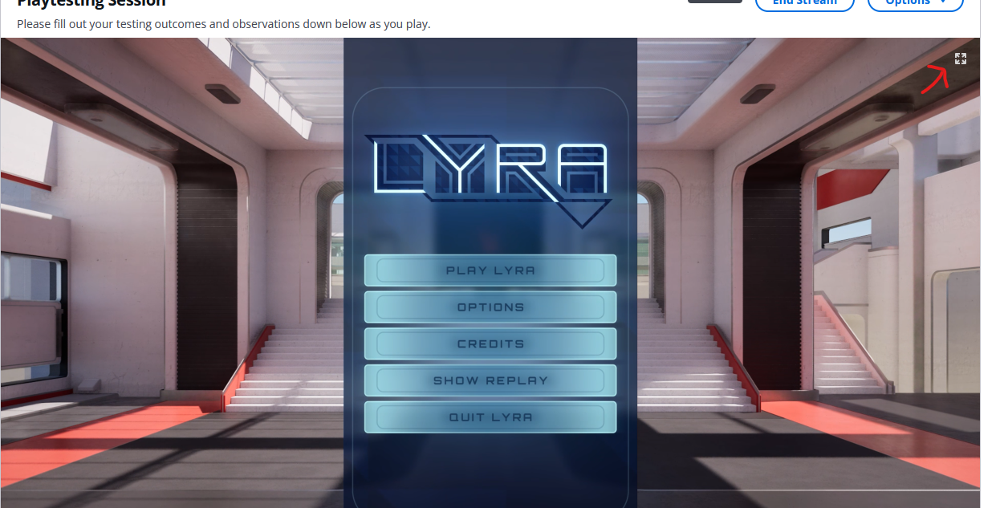

Lastly, if you try playtesting a session that has been disabled or no longer valid you will receive an error message like the one below.  At anypoint you feel like there shouldn't be an error please reach out to the studio hosting the event.

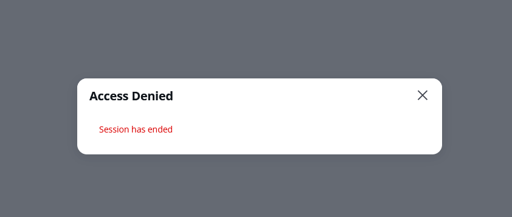

**NOTE: If you are still playing will a session does get disabled or expires you will be able to continue playing until you either terminate the session, close the browser, or studio forcefully shuts down the session**

#### Running the Bot

Refer [here](https://github.com/aws-solutions-library-samples/guidance-for-scalable-game-playtesting-and-qa-on-aws/blob/main/source/bot/README.md) to guide you through how to run the bot.

## Next Steps

This guidance demonstrates setting up a single playtest session with a single Discord bot. For multiple playtest sessions running simultaneously, you can deploy multiple versions of the Discord bot with different Session IDs. Additionally, while this guide demonstrates a simple playtest session setup using a single region, you may want to consider leveraging multiple regions. 


## Cleanup

- Empty the S3 buckets that host the frontend application:

    - Navigate to S3
    - Locate and empty the two buckets that begin with "playtestingfrontendstack-xxxxxxxx"

- Delete the API stack:

    - Open the CloudFormation console (ensure you are in us-east-2, the default region for the API Stack)
    - Select the PlaytestingApiStack
    - Delete the stack

- Delete the frontend stack:

    - Open the CloudFormation console (ensure you are in us-east-1, the default region for the frontend stack)
    - Select the PlaytestingFrontendStack
    - Delete the stack
