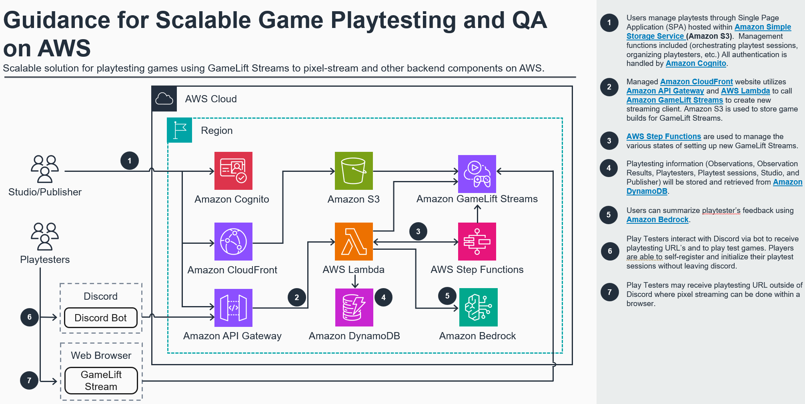

© 2025 Amazon Web Services, Inc. or its affiliates. All Rights Reserved.

This AWS Content is provided subject to the terms of the AWS Customer Agreement available at http://aws.amazon.com/agreement or other written agreement between Customer and either Amazon Web Services, Inc. or Amazon Web Services EMEA SARL or both.

# Welcome to the Amazon Playtesting Solution guidance

This solution deploys a Single Page Application (SPA) built with [ReactJS](https://react.dev/), an API built with [Amazon API Gateway](https://aws.amazon.com/api-gateway/), [AWS Lambda](https://aws.amazon.com/lambda/), [AWS Step Functions](https://aws.amazon.com/step-functions/), and [Amazon Cognito](https://aws.amazon.com/cognito/) for authorization and authentication to host Amazon GameLift stream sessions behind a login page. It further uses an [Amazon DynamoDB](https://aws.amazon.com/dynamodb/) table for meta information around playtesting sessions as well as registered play testers. 
  
## How to Deploy the solution guidance

This CDK stacks deploy both a frontend and a backend for the solution guidance.  Adding and removing most GameLift Streams resources can be handled directly within the frontend application.



The Application is deployed through 2 cdk stacks:

1. **BackendStack:** Deploys the serverless API to a region of your choice. This includes 
   1. All needed Lambda functions as well as step functions
   2. Amazon API Gateway 
   3. AWS WAF to secure the API
   4. Amazon DynamoDB Table for meta information
   5. Amazon Cognito for authorization and authentication
1. **FrontendStack:** Deploys a single page application (SPA) to `us-east-1`. This deployment includes:
   1. Amazon S3 bucket containing the playtesting frontend SPA
   2. Amazon CloudFront CDN distribution distributing the SPA
   3. AWS WAF to secure the CloudFront distribution

### Deployment

1. Download the latest gamecast aware `aws-sdk` from the Amazon GameCast Console.
2. Unzip and copy the `aws-sdk` folder to the folder `dependencies` in this project.
3. Run `npm install npm-run-all --save-dev` and run `npm run install-all` in the root of this project to install dependencies in all subprojects and lambdas. [CDK Bootstrap if you have not previously deployed infrastructure using cdk into your AWS account.](https://docs.aws.amazon.com/cdk/v2/guide/bootstrapping.html).
4. Run `cdk deploy GameCastDemoApiStack` to deploy the API and get the ouputs required for the frontend build.
4. Update the AWS Amplify SDK configuration in the `demo-frontend/src/App.tsx` with the API endpoint and the userpool and client ID from the output. Ensure that the API endpoint has no trailing slash `/` at the end.
5. Run `npm run build-all` in the root of the project to build the single page application fronend.
6. Run `cdk deploy GameCastDemoFrontendStack` to deploy the frontend.
7. Once everything is deployed, you need to add meta information about your StreamGroup to the deployed DynamoDB table. For each of your stream groups, add the `streamgroup Identifer` as key and at minimum add `name` and `description`. If your game requires `AdditionalLaunchArgs` or `AdditionalEnvironmentVariables`, provide them as a list of strings.

_Once everything has been deployed once and the frontend has the right parameters, you can use `cdk deploy GameCastDemoFrontendStack` to redeploy both stacks in a single step when developing as the frontend has a dependency to the backend stack._

### Creating an Applications and Stream Groups

Please follow the instructions of the Amazon GameCast developer documentation found in the Amazon GameCast AWS console.

## Adding StreamGroups and Applications

To add a StreamGroup and Application to the demo, you need to add meta information to the created Amazon DynamoDB table. The `ListGames` Lambda functions will pick up any changes done to the DynamoDB automatically. This allows you to hide/show certain stream groups and applications by adding or removing them from DynamoDB.

The meta data structure looks like this:

```json
{
  "sgId": "<sg-id>", // the stream groups id
  "appId": "<app-id>", // The applications id - it need to be the SG
  "region": "eu-central-1", // the region is crucial so that the start stream session lambda uses this region to create the GameCast client to start the stream session
  "AdditionalLaunchArgs": [ // optional launch arguments
  ],
  "AdditionalEnvironmentVariables": [ // optional environment variables
  ],
  "description": "Lyra is a learning resource designed as a sample game project to help you understand the frameworks of Unreal Engine 5 (UE5). Its architecture is designed to be modular, including a core system and plugins that are updated regularly along with the development of UE5.",
  "name": "Lyra UE5 Sample Game"
}
```

Required fields: **sgId**, **appId**, **region**, **name**, **description**

## Frontend Development

Once the API stack is deployed and you have update the Amplify config values in `App.tsx`, you can use `npm start` in the `demo-frontend` to run the frontend locally with the API in the cloud to accelerate your frontend development without the need of redeployment for every code change.

## Updating the GameCast WebSDK

The WebSDK used can be found in `demo-frontend/src/gamecastsdk/`. You can update the files to a newer version. New versions may require code changes in `demo-frontend/src/components/game.tsx`.