# Project Setup Guide for the Discord Bot

This guide walks you through setting up and configuring the Discord bot.

## Prerequisites

Before you begin, make sure you have the following installed/prepared:

- [Node.js](https://nodejs.org/) (v16.9.0 or higher)
- [npm](https://www.npmjs.com/) (comes with Node.js)
- A [Discord account](https://discord.com/)
- A Discord server where you have permission to add bots

## 1. Install Node.js

- **Windows**  
  Download the Windows installer from the [Node.js website](https://nodejs.org/) and follow the setup wizard.

- **macOS**  
  Either:  
  1. Download and run the macOS installer from the [Node.js website](https://nodejs.org/), _or_  
  2. Use Homebrew:

     ```sh
     brew install node
     ```

- **Linux**  
  Use your distribution’s package manager, or check the official [Node.js installation guide](https://nodejs.org/en/download/package-manager/) for distro-specific instructions.  

---
## 2. Prepare Your Project Folder

1. Open the folder containing  your bot.

2. Open your terminal in the project folder.

3. Confirm Node.js is installed:

   ```sh
   node -v
   ```

   You should see a version (preferably v16 or higher).

---

## 3. Install discord.js

Install `discord.js` :

```sh
npm install discord.js

```
---
## 4. Setting Up a Bot Application (via Discord Developer Portal)

1. Go to the [Discord Developer Portal](https://discord.com/developers/applications)
2. Click "New Application"

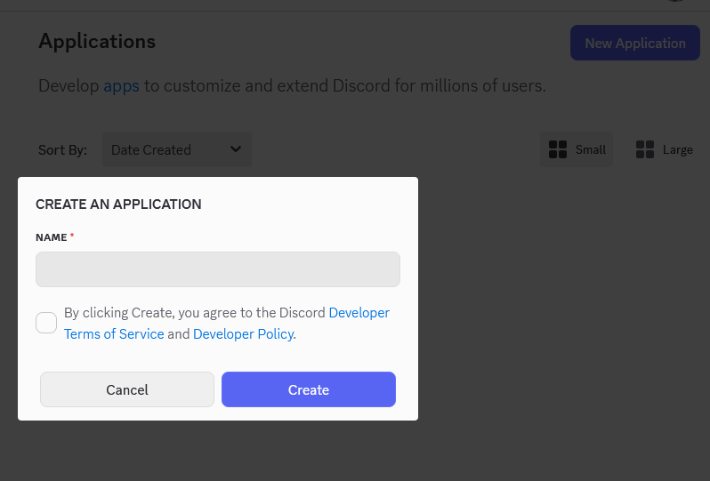

3. Name your application and click Create.  You'll then be sent to the general information tab of your new bot.

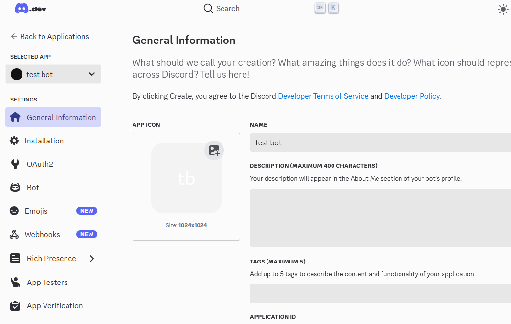

4. Navigate to the *OAuth2* menu item on the left side.  Select "bot" in the third column of the available *scopes* as well as "applications.commands" which is located in the second column.  When you select "bot" a new section called *BOT PERMISSIONS* will become available down below.

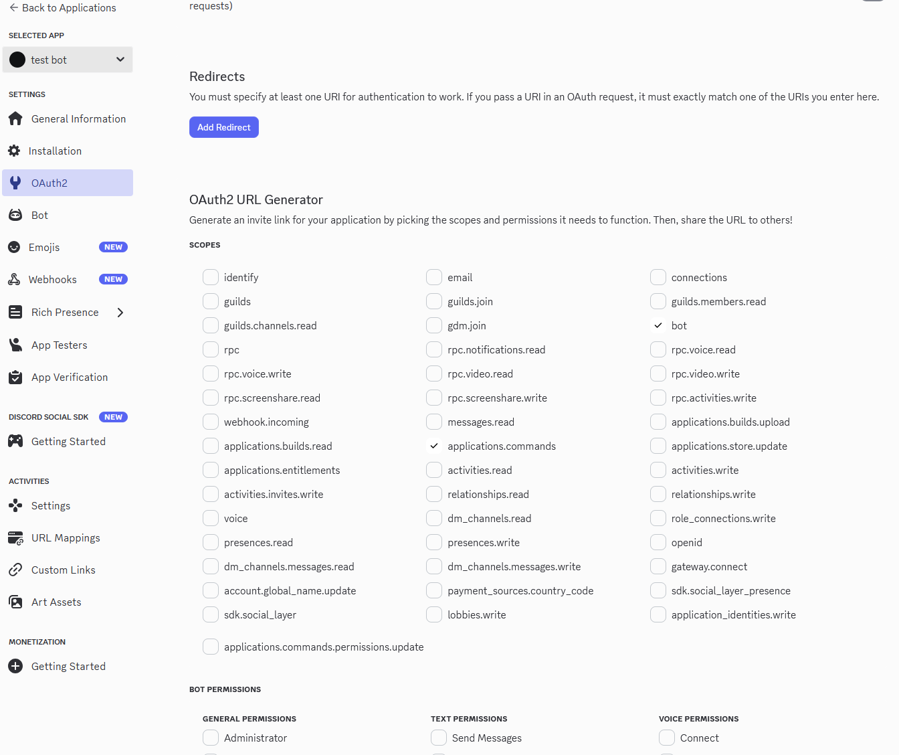

5. Enable these Bot Permissions
   - View Channels
   - Send Messages
   - Send Messages in Threads
   - Manage Messages
   - Read Message History
   - Use Slash Commands
6. Make sure the Integration Type is set to Guild Install
7. Copy the generated URL and paste it into your browser

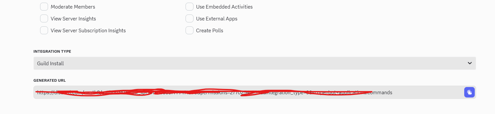

8. Select the server you would like to add your bot to and click continue

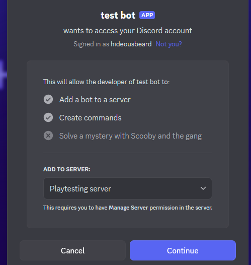

9. Confirm the permission set for this server's version of the bot and then click authorize

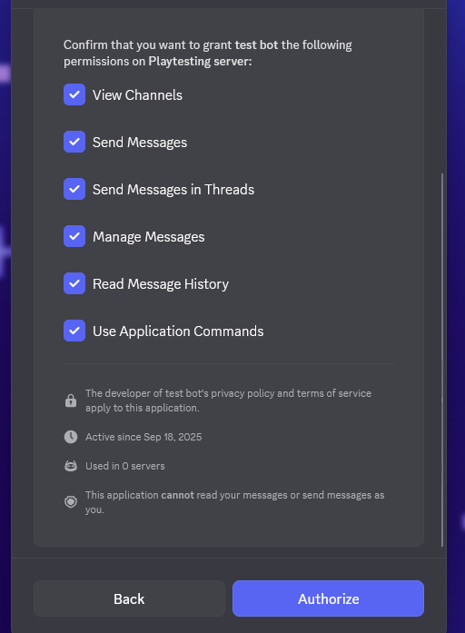

#### Note: If you plan to publish or verify your bot, only enable permissions that are truly necessary.
#### Note: You must have Manage Server permission in the chosen server to add bots.
---
## 5. Edit the config.json file with your bot's specifics
1. Open up the config.json file that is located in the same bot directory
2. Add the token, clientID, and guildID found within your bot's Developer Portal to the config.json file
   - Token is found underneath the Bot menu.  There is a Reset Token button that you'll need to click to generate a new token
   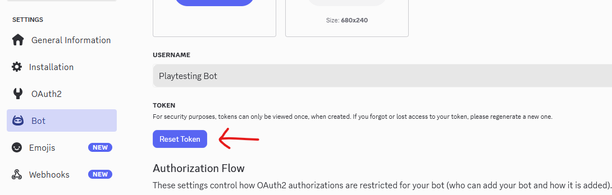

   - ClientID can be found under the OAuth2 menu option from the left side.
   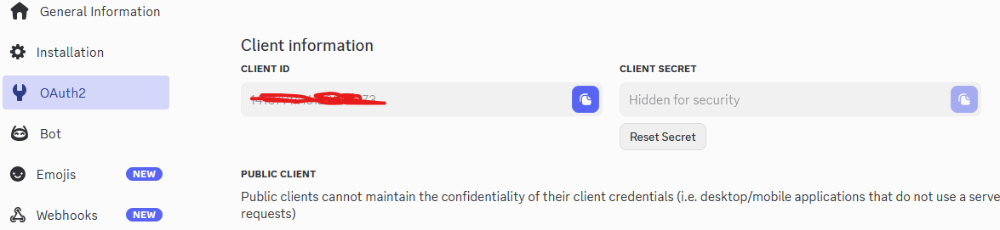

   - GuildID can be found within the normal Discord application (not the developers portal).  Make sure that users enable these settings: *settings→advance→enable Developer Mode*.  Then you can right click on your server name from your Discord server list and “copy server ID”
   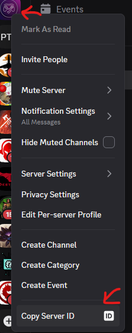

3. Adding the apiBaseUrl and apiKey
   - apiBaseUrl can be found by going into your AWS console (after installing the playtesting solution) and make sure you've selected the region in which your Playtesting solution backend was installed (Default is us-east-2).  Navigate to Amazon API Gateway then select the *PlaytestingApiStack-playtesting-api* api.  Select *stages* on the left-hand side menu.  Finally, copy the *Invoke URL* from the "prod" stage as seen below.  Copy that to your config file
   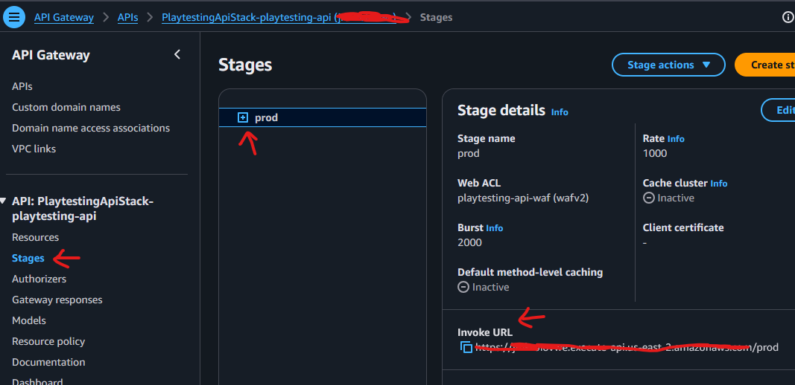

   - apiKey can be found from within the same Amazon API Gateway console location, but this time you'll click on *API Keys* located on the lefthand side menu.  From there, copy the key and save it to your config file as well
   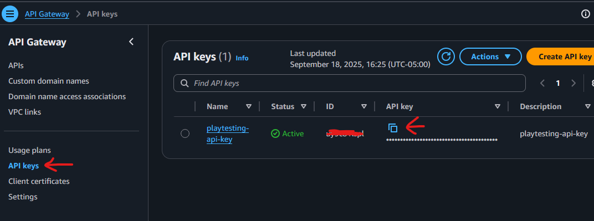
---

## 6. Run the bot
Open up a new terminal and navigate to your bot directory.  Now that we've configured the bot, register the commands to Discord by running the deploy-commands file:
```sh
   node deploy-commands.js
   ```
And finally run the bot:
```sh
   node index.js
   ```

## How to register and connect players to the stream
With the bot deployed and running, you can now have users interact with it using slash commands within the server the bot is deployed in.

For example, if wanting to register for an existing playtesting session, users will input the following command:
```sh
   /register
   ```
 
 The bot will then confirm if the user would like to be added to the playtesting event.

If confirmed, the bot will then call the API backend using the player's global Discord username as an identifier.  The bot will return back any eligible playtest sessions that the playtester can register for.  After selecting which session the playtester will be prompted for their email address.  When an email address is given the bot will finish the registration process and will return back a unique URL for the playtester.  If the playtester had previously register for other playtest sessions in the past then they would already have an account that they can login with; otherwise they'll have to retrieve their temporary password from their email account before they can login.  After logging in for the first time, the playtester must change their password.

**NOTE: During the registration process there are timeout windows (such as for entering in your email).  If the process times out, you'll have to start the registration process again**

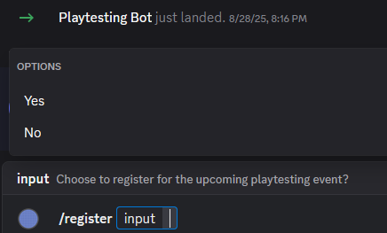

Selecting which playtest session to register for down below

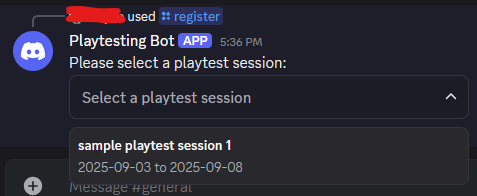

Email entry screen shot

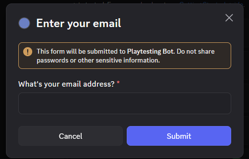


If you wish to retrieve an existing registered events URL you can utilize the /getURL command:
```sh
   /getURL
   ```

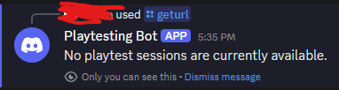

**NOTE: This command will only show you event's that you have registered for.  It will not show you available events you can register for.  You will need to use the /register command to see all available events**

#### Note, the bot will send the response to the user through usage of ephemeral messaging only available to registered Discord bots to reduce phishing risk, as well as to avoid cluttering the server itself. This can also be disabled within the register command's code if preferred.

## Adding new commands to the bot
As your bot's needs evolve, you can add additional commands by creating additional Javascript files for each new command as displayed within the commands/utility folder. For more information, see the Discord.js library documentation [here](https://discord.js.org/docs/packages/discord.js/14.21.0).


Once created and added to the utility folder, register the new command to Discord by running the deploy-commands file:
```sh
   node deploy-commands.js
   ```

And restart the bot: 
```sh
   node index.js
   ```
